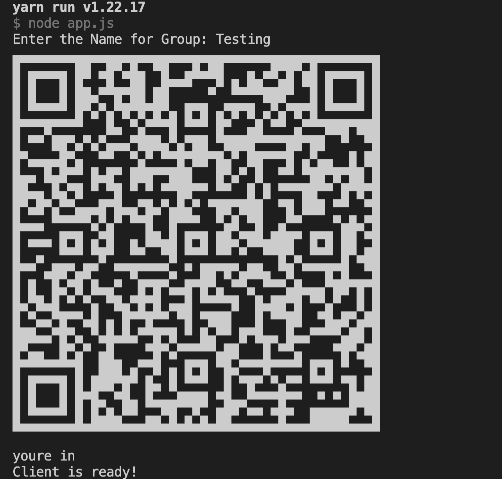

# Whatsapp Group Creator From CSV

> This will help you to creator Whatsapp group with participant's phone numbers in excel format

### How to Use

1. Paste the phone Numbers in the contact.csv file
2. Check your have installed Nodejs version above 12
3. Then install all packages by command yarn install or npm install
4. Now you can start the program by command npm start or yarn start
5. Then scan the QR code displayed in the terminal
6. A prompt will ask for the Group name, just give that
7. Sit back and relax
8. After creating just logout the whatsapp web in your mobile

#### For those numbers that cannot be added to group, group invite will sent for them

## Screenshots

